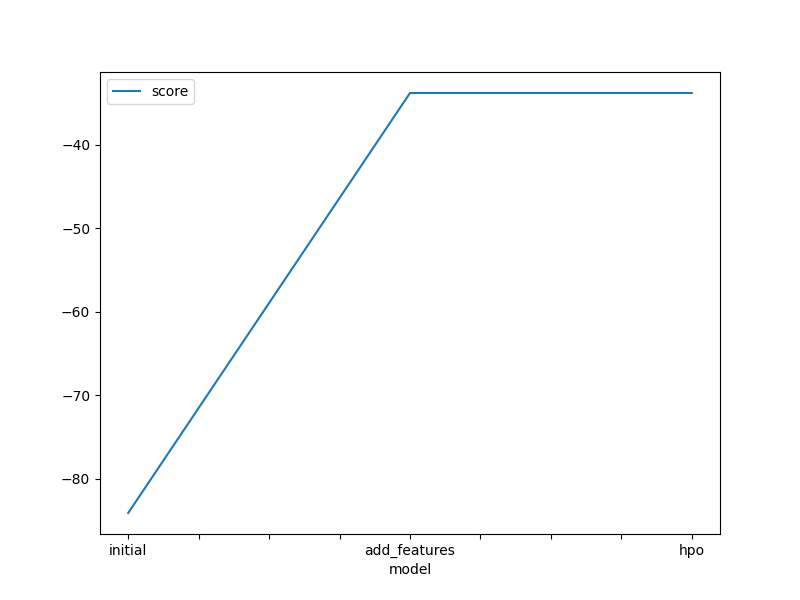

# Report: Predict Bike Sharing Demand with AutoGluon Solution

#### Ahmed Karem Mousa

## Initial Training

### What did you realize when you tried to submit your predictions? What changes were needed to the output of the predictor to submit your results?

We had to exclude negative values, but honestly I got no negative value, idk why

### What was the top ranked model that performed?

The model that used mean absolute error with more feature engineering of using hours, days and months.

## Exploratory data analysis and feature creation

### What did the exploratory analysis find and how did you add additional features?

There was a pattern in date columns that could be used for feature engineering, also there is a correlation between temp and humidaty that can be used for feature selection

### How much better did your model preform after adding additional features and why do you think that is?

The performance was doubled, and that's because it denoises the data, and gives more correlation to predict from.

## Hyper parameter tuning

### How much better did your model preform after trying different hyper parameters?

Most of the time it didn't improve, it only improved with different metric which was mean absolute error and by a very small ammount, by 0.1 only.

### If you were given more time with this dataset, where do you think you would spend more time?

With feature engineering, it clearly can help a lot.

### Create a table with the models you ran, the hyperparameters modified, and the kaggle score.

| model        | hpo1                    | hpo2               | hpo3                | score   |
| ------------ | ----------------------- | ------------------ | ------------------- | ------- |
| initial      | root_mean_squared_error | mean_squared_error | mean_absolute_error | 1.83709 |
| add_features | root_mean_squared_error | mean_squared_error | mean_absolute_error | 0.63296 |
| hpo          | root_mean_squared_error | mean_squared_error | mean_absolute_error | 0.63296 |

### Create a line plot showing the top model score for the three (or more) training runs during the project.

### Create a line plot showing the top kaggle score for the three (or more) prediction submissions during the project.

## Summary

Autogluon can boost and give you best performance that is hard to tune, despite that it's still benifical to try some hypertunning, but it's best to spend more effort on our data and feature engieering!!!.
